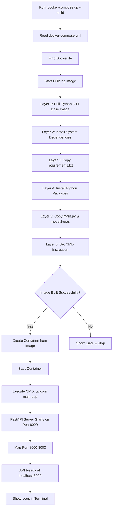
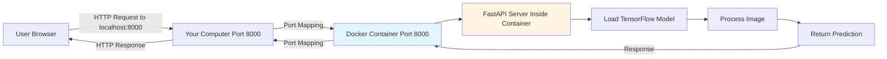

# Docker Deployment Guide - Understanding Containerization

## What is Docker?

Think of Docker as a **shipping container for your code**. Just like how a shipping container can hold anything and be transported anywhere, Docker containers package your app with everything it needs (Python, libraries, etc.) so it runs the same on any computer.

---

## The Setup Breakdown

### **1. Dockerfile - The Blueprint**

```dockerfile
FROM python:3.11-slim
```

-   **What it does**: Says "start with a pre-made box that already has Python 3.11 installed"
-   **Why**: You don't have to install Python manually - Docker gives you a clean environment

```dockerfile
WORKDIR /app
```

-   **What it does**: Creates a folder called `/app` inside the container and moves there
-   **Think of it as**: Opening a new folder to organize your project files

```dockerfile
RUN apt-get update && apt-get install -y libglib2.0-0 ...
```

-   **What it does**: Installs system tools that TensorFlow needs to work (like installing drivers)
-   **Why**: TensorFlow requires these low-level libraries to process images and run the AI model

```dockerfile
COPY requirements.txt .
RUN pip install --no-cache-dir -r requirements.txt
```

-   **What it does**:
    1. Copies your `requirements.txt` file into the container
    2. Installs all Python packages (FastAPI, TensorFlow, etc.)
-   **Why copy requirements first**: Docker is smart - if requirements don't change, it reuses this step next time (faster builds!)

```dockerfile
COPY main.py .
COPY model.keras .
```

-   **What it does**: Copies your Python code and AI model into the container
-   **Now the container has**: Python + libraries + your code + your model

```dockerfile
EXPOSE 8000
```

-   **What it does**: Labels port 8000 as the door where your API will listen
-   **Note**: This is just documentation - the real port mapping happens when you run the container

```dockerfile
CMD ["uvicorn", "main:app", "--host", "0.0.0.0", "--port", "8000"]
```

-   **What it does**: This is the command that runs when the container starts
-   **Translation**: "Start the FastAPI server on port 8000, accessible from outside the container"

---

### **2. .dockerignore - What NOT to Pack**

```
__pycache__
*.ipynb
.git
```

-   **What it does**: Tells Docker to ignore these files when copying (like `.gitignore`)
-   **Why**: No need to copy cache files, notebooks, or git history - keeps the image smaller and faster

---

### **3. docker-compose.yml - The Easy Button**

```yaml
services:
    drowsiness-api:
        build: .
```

-   **What it does**: Tells Docker Compose "build an image from the Dockerfile in this folder"

```yaml
ports:
    - "8000:8000"
```

-   **What it does**: Maps port 8000 on your computer → port 8000 inside the container
-   **Think of it as**: Opening a tunnel so you can talk to the app inside the container
-   **Format**: `"YOUR_COMPUTER:CONTAINER"`

```yaml
restart: unless-stopped
```

-   **What it does**: If the container crashes, automatically restart it
-   **Useful for**: Production deployments

---

## Flow Diagrams

### **Docker Build & Run Process**



### **Request Flow (User → API in Docker)**



### **Docker Architecture Overview**

```
┌─────────────────────────────────────────────────────────────┐
│                     Your Computer                            │
│                                                              │
│  ┌────────────────────────────────────────────────────┐    │
│  │            Docker Engine                            │    │
│  │                                                      │    │
│  │  ┌────────────────────────────────────────────┐   │    │
│  │  │     Container: drowsiness-detection-api    │   │    │
│  │  │                                             │   │    │
│  │  │  ┌──────────────────────────────────┐     │   │    │
│  │  │  │  /app                             │     │   │    │
│  │  │  │  ├── main.py                      │     │   │    │
│  │  │  │  ├── model.keras                  │     │   │    │
│  │  │  │  └── Python + Libraries           │     │   │    │
│  │  │  │      • FastAPI                    │     │   │    │
│  │  │  │      • TensorFlow                 │     │   │    │
│  │  │  │      • Uvicorn                    │     │   │    │
│  │  │  └──────────────────────────────────┘     │   │    │
│  │  │                                             │   │    │
│  │  │  Port 8000 (Internal) ←→ Mapped to         │   │    │
│  │  │  Host Port 8000                            │   │    │
│  │  └────────────────────────────────────────────┘   │    │
│  └────────────────────────────────────────────────────┘    │
│                                                              │
│  Your Computer's Port 8000 ← Accessible here                │
└─────────────────────────────────────────────────────────────┘
           ↑
           │
    HTTP Requests from
    localhost:8000
```

---

## How It All Works Together

### **When you run: `docker-compose up --build`**

**Step 1: Building the Image** (like baking a cake from a recipe)

```
1. Docker reads the Dockerfile
2. Downloads Python 3.11 base image (~100MB)
3. Installs system dependencies
4. Installs Python packages (TensorFlow ~1GB)
5. Copies your code and model
6. Creates a final "image" - a frozen snapshot of everything
```

**Step 2: Creating the Container** (like taking a slice of the cake)

```
1. Docker takes the image
2. Creates a running "container" from it
3. This is an isolated environment with its own:
   - File system
   - Network
   - Processes
```

**Step 3: Starting the API**

```
1. Container executes the CMD: uvicorn main:app --host 0.0.0.0 --port 8000
2. FastAPI server starts inside the container
3. Listens on port 8000 INSIDE the container
4. Docker maps port 8000 (your computer) → 8000 (container)
```

**Step 4: You Can Access It**

```
Your browser → localhost:8000 → Docker maps to → Container:8000 → FastAPI
```

---

## Layer Caching Visualization

```
┌─────────────────────────────────────────────┐
│ Layer 1: FROM python:3.11-slim              │ ← Cached (rarely changes)
├─────────────────────────────────────────────┤
│ Layer 2: RUN apt-get install...            │ ← Cached (rarely changes)
├─────────────────────────────────────────────┤
│ Layer 3: COPY requirements.txt              │ ← Cached (if unchanged)
├─────────────────────────────────────────────┤
│ Layer 4: RUN pip install -r requirements    │ ← Cached (if unchanged)
├─────────────────────────────────────────────┤
│ Layer 5: COPY main.py model.keras           │ ← Rebuilt (changes often)
├─────────────────────────────────────────────┤
│ Layer 6: CMD ["uvicorn", "main:app"...]     │ ← Rebuilt (metadata)
└─────────────────────────────────────────────┘

💡 Only layers after the first change are rebuilt!
   This is why we copy requirements.txt before the code.
```

---

## Real-World Analogy

**Without Docker:**

-   "Hey, run my app!"
-   "Okay, but I need Python 3.11, TensorFlow 2.16, FastAPI 0.115..."
-   "Also, I need these system libraries..."
-   "Wait, your Python version is different? It won't work!"

**With Docker:**

-   "Hey, run my app!"
-   `docker-compose up`
-   ✅ Done! Everything is packaged together.

---

## Key Concepts

### **Image vs Container**

-   **Image**: The recipe/blueprint (frozen, unchangeable)
-   **Container**: A running instance from the image (active, can be started/stopped)
-   **Analogy**: Image = Program file (.exe), Container = Running program

### **Port Mapping: `-p 8000:8000`**

```
Your Computer          Docker Container
Port 8000       →      Port 8000
(accessible)           (isolated)
```

Without this mapping, the container's port 8000 is isolated - you couldn't reach it!

### **Why Docker for Your API?**

1. **Consistency**: Works on Windows, Mac, Linux - always the same environment
2. **Isolation**: Doesn't mess with your system Python or other projects
3. **Easy deployment**: Push the image to cloud → they run it → instant deployment
4. **Reproducible**: Anyone can run `docker-compose up` and get the exact same setup

---

## What Happens Behind the Scenes

```
You: docker-compose up
     ↓
Docker Compose reads docker-compose.yml
     ↓
Finds Dockerfile, starts building
     ↓
Layer 1: Python base image (cached if downloaded before)
Layer 2: System dependencies (cached if unchanged)
Layer 3: Python packages (cached if requirements.txt unchanged)
Layer 4: Your code (always fresh)
     ↓
Creates container from final image
     ↓
Runs: uvicorn main:app --host 0.0.0.0 --port 8000
     ↓
Server starts, you see logs in terminal
     ↓
API is now accessible at localhost:8000
```

---

## Common Beginner Questions

**Q: Why is it so big (1.5GB)?**  
A: TensorFlow is huge! It includes tons of AI libraries. You could use `tensorflow-cpu` to make it smaller.

**Q: Do I need to rebuild every time I change code?**  
A: Yes, OR you can use volumes (mounting your local files into the container) for development.

**Q: Where is the container running?**  
A: It's running on your computer, but in an isolated environment managed by Docker.

**Q: Can I have multiple containers?**  
A: Yes! You could run your API in one container, a database in another, etc. They can talk to each other.

**Q: What's the difference between `docker` and `docker-compose`?**  
A: `docker` is for single containers, `docker-compose` manages multiple containers and their configuration easily.

---

## Quick Reference Commands

```bash
# Build and start
docker-compose up --build

# Run in background
docker-compose up -d

# Stop containers
docker-compose down

# View logs
docker-compose logs -f

# Rebuild after changes
docker-compose up --build

# List running containers
docker ps

# Access container shell
docker exec -it drowsiness-detection-api bash

# Remove all containers and images
docker system prune -a
```

---

## Next Steps

1. ✅ Run locally: `docker-compose up --build`
2. 🧪 Test API: Visit http://localhost:8000/docs
3. 🚀 Deploy to cloud: Try Render, Railway, or Fly.io (see README-Docker.md)
4. 📚 Learn more: [Docker Official Tutorial](https://docs.docker.com/get-started/)

---

**Created**: November 16, 2025  
**For**: Drowsiness Detection API Deployment
